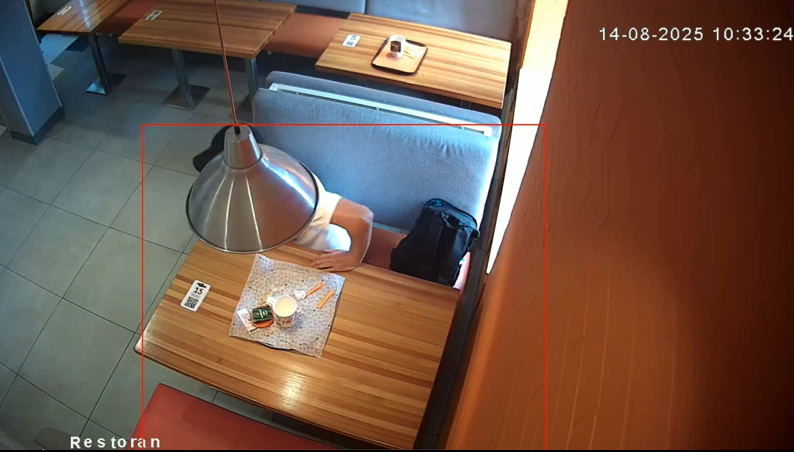

# Прототип системы детекции уборки по видео

## Запуск проекта

### Установка зависимостей

```
pip install -r requirements.txt
```

### Запуск

Добавить видео в папку
Запустить:
```
python main.py --video input.mp4
```
После запуска будет показан первый кадр видео, на котором надо выбрать область слежения и нажать Enter
После запустится видео и в реальном времени можно будет отслеживать изменения. 
Выйти и сохранить, то что уже отрисовалось: нажать 'q'.

## Какое видео и какой столик были выбраны.

Выбрал "Видео 2", там один столик, который хорошо видно

## Логика

Для детекции используется модель YOLOv8n (обнаружение людей). 
Если в кадре есть человек - столик занят. Если в кадре нет людей - столик свободен.
Добавлена искусственная задержка в 60 кадров, чтобы убрать мерцание, если модель "потеряла" человека.

## Полученный результат

Среднее время задержки в выбранном видео 55 секунд

## Пример проблемного кадра


человек за лампой не был распознан. Из-за этого началось мерцание. Была добавлена задержка в несколько кадров

## Результат работы

### Полученное видео

[output.mp4](https://drive.google.com/drive/folders/1Rc7tfZWO2sIfnzPx3AQahuv_XcoYUp7t?usp=sharing)

### Аналитика


### Вывод в консоль:

--- Report ---
Total events: 14
Avg time between departure and approach:  54.90 sec

Result saved in output.mp4 and events.csv

# Что можно улучшить

## Если бы это был реальный проект, то:
1. Сделать реально хорошую структуру. 
2. Разбить все на модули (сервисы, детекторы, загрузка\выгрузка видео, составление отчета)
3. Сделать интерфейсы для детекторов, классы состояний и т.д.
4. Сделать тесты
5. Docker файл
6. Использовать FastAPI, celery, redis для создания API, отправки задач

Получится монолит, но можно все это и микросервисами сделать, если много видео обрабатывать надо. Зато масштабируемость будет

## Возможная структура

detectionSys
    src
        core
            detectors.py        интерфейс детекторов
            roi_selector.py     ROI
            table_states.py     Классы состояний
        services
            video_handler.py    обработчик видео
            event_logger.py     логика событий
            report.py           отчеты
            video_src.py        загрузка видео
            output.py           запись видео и csv файла
            celery_tasks        celery
        cli
            main.py
    tests
        тесты
    requirements.txt
    docker
        Dockerfile
        docker-compose.yml